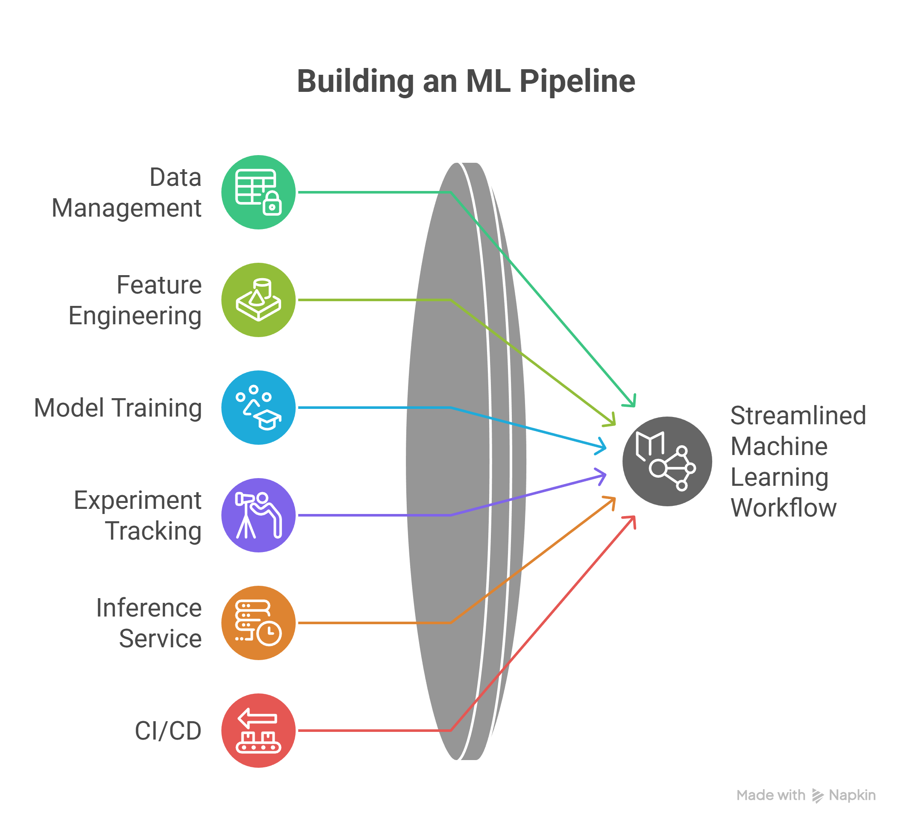

# CreditShield– Credit Card Fraud Detection (MLOps Project)

> **Production-ready end-to-end ML system for real-time fraud detection with strong MLOps, CI/CD, and monitoring practices.**

---

## Project Highlights

- End-to-end **ML → API → Docker → CI/CD** pipeline  
- Handles **highly imbalanced financial datasets**  
- **Explainable AI (SHAP)** for audit and compliance  
- **MLflow + DVC** for experiment and data versioning  
- **Jenkins CI (Docker-based)** for automated builds  
- **Model monitoring** with Evidently and Prometheus  
- Designed for **scalable, production deployment**

---

## Project Overview

### Situation
Financial fraud detection systems demand high accuracy, explainability, and production reliability. Many ML models fail in real-world deployment due to data imbalance, lack of monitoring, and missing CI/CD pipelines.

---

### Task
Build a **production-grade fraud detection system** that:
- Accurately detects fraudulent transactions  
- Handles extreme class imbalance  
- Provides explainability for audits  
- Follows modern **MLOps best practices**  
- Is deployable via API and CI/CD pipelines  

---

### Action

#### Machine Learning
- Performed **EDA and feature engineering** on transaction data  
- Addressed class imbalance using **SMOTE**  
- Trained models using **XGBoost and Scikit-learn**  
- Implemented **SHAP** for model interpretability  

#### MLOps & Engineering
- Tracked experiments and metrics using **MLflow**  
- Versioned datasets and pipelines using **DVC**  
- Built a **FastAPI-based inference service**  
- Containerized the service using **Docker**  
- Implemented **CI pipelines using Jenkins (Dockerized)**  
- Added **data and concept drift detection** using Evidently  
- Exposed application metrics using **Prometheus**

---

### Result
- Delivered a **fully production-ready ML system**  
- Ensured **reproducible training and data lineage**  
- Enabled **transparent, explainable predictions**  
- Built a **CI/CD-enabled Dockerized service**  
- Demonstrated strong **ML, MLOps, and software engineering skills**

---

## System Architecture

